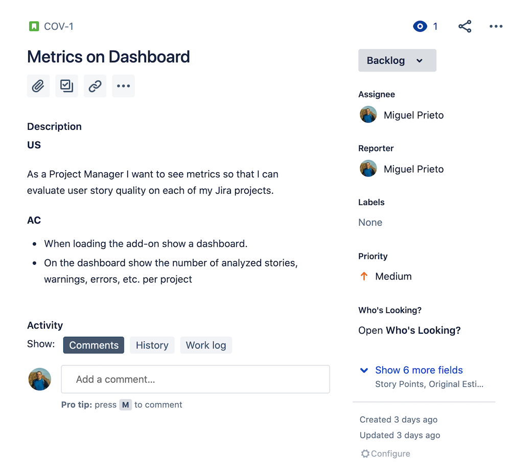

# STORY LINTER

"Story Linter" is a Jira Cloud application built with Atlassian Connect. Checkout [this
video](https://www.youtube.com/watch?v=qzxVBjV5g60) for a quick intro on Atlassian Connect Framework.

As a [linter](https://en.wikipedia.org/wiki/Lint_(software))
analyzes source code to identify and report issues, like potential bugs, stylistic errors and suspicious constructs,
this Jira add-on will analyze your user stories and show warnings or alerts if any story does not follow (an opinionated)
set of rules or format.

## User Story Expected Format

The description of your Jira User Stories should be written following the well-known User Story template (see: [User Stories with Examples and Template](https://www.atlassian.com/agile/project-management/user-stories)) 
and include an Acceptance Criteria which should be a bullet list of items that must be fulfilled to consider the story as done.


```text
“As a [persona], I [want to], [so that].”

AC
- Acceptance Criteria 1
- Acceptance Criteria 2
```


E.g.




----

## Stack 

#### Backend
- Kotlin.
- Sprint Boot 2.3.0.
- MySQL 8.0.x or H2.
- [**Atlassian Connect for Spring Boot**](https://developer.atlassian.com/cloud/jira/platform/frameworks-and-tools/)
_Handles tasks like JWT authentication and signing, persistence of host details, installation and uninstallation callbacks, and serving the app descriptor._

#### Frontend
- Gatsby.

---

### MySQL setup

- Create a MySQL database (or use an existing one, of course) 
```bash
docker pull mysql:8.0.20
docker run --name mysql-covidio -p 3306:3306 -e MYSQL_ROOT_PASSWORD='pazz' -e MYSQL_ROOT_HOST='%' -v /Users/jmpr/ticket-linter/data/mysql:/var/lib/mysql -d mysql:8.0.20
```

- Create a database schema `covidio`
```mysql
create schema covidio;
```


- Set an app user user
```mysql
CREATE USER 'linter-app'@'%' IDENTIFIED BY 'xxxxxx';
GRANT ALL PRIVILEGES ON covidio*.* TO 'linter-app'@'%' WITH GRANT OPTION;
```

- Database connection configuration
```yaml
spring:
  jpa:
    generate-ddl: true
    database-platform: org.hibernate.dialect.MySQL8Dialect
    show-sql: true
    hibernate:
      ddl-auto: update
  datasource:
    url: jdbc:mysql://localhost:3306/covidio
    driverClassName: com.mysql.jdbc.Driver
    username: linter-app
    password: xxxxxx
```

The database schema will be created/updated once you run the app.

If Liquibase lock remains stuck (https://stackoverflow.com/questions/15528795/liquibase-lock-reasons)

### Running the backend

```bash
SPRING_PROFILES_ACTIVE=local-myconfig ./gradlew xdome-rest:bootRun
```

_WORK IN PROGRESS_

### TODO
1. Go through TODOs and FIXMEs in the code.
2. Containerize application.
3. Improve dev documentation.
4. Improve user documentation e.g. what rules are being enforced.
5. Add a [web panel](https://developer.atlassian.com/cloud/jira/software/modules/web-panel/) in order to allow a user to see the evaulation of a ticket without running a full scan.
